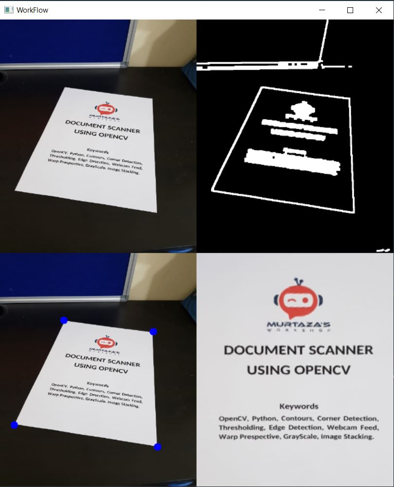

# Document-Scanner
Document Scanner is developed using OpenCV. The objective of this project is to scan a document using webcam and get its bird's eye view. First, it preprocess the image using some preprocessing techniques like GrayScale, Gaussian Blur, Canny etc. in order to detect the edges properly to find the biggest contour and use the corner points to warp the image and get the bird's eye view.

